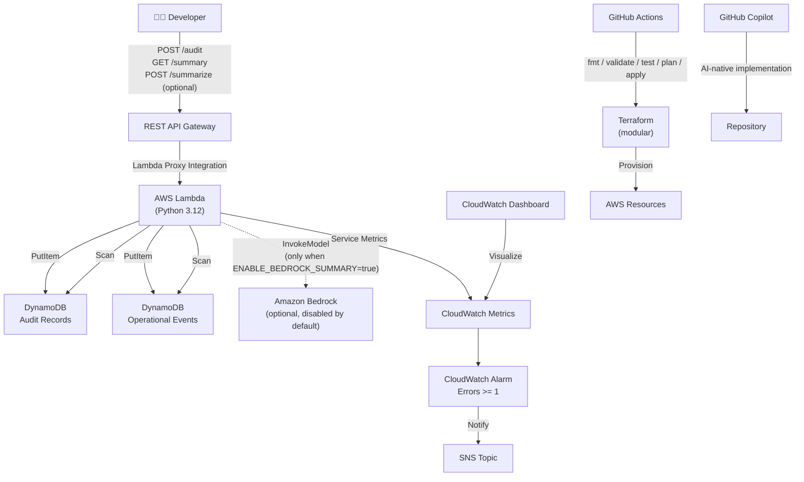

# Platform Ops Auditor

> A minimal, clean, demoable **internal developer platform automation service** built for a Senior Platform Engineer coding challenge.

[](https://github.com/lumen-maximus/ngx-interview/actions/workflows/terraform.yml)

---

## 🚀 Live Demo

> **The Platform Ops Console is deployed and live — open it now:**
>
> ### 👉 [http://platform-ops-auditor-dev-web-830146370919.s3-website-us-east-1.amazonaws.com/](http://platform-ops-auditor-dev-web-830146370919.s3-website-us-east-1.amazonaws.com/)

No credentials required. Visit the link to interact with the deployed service directly:
- Submit a service audit via the **Submit Service Audit** form
- View aggregated platform health via **Refresh Summary**
- Generate an AI posture summary via **Generate AI Summary**

---

## Project Summary

**Platform Ops Auditor** lets developers submit service audit metadata through a REST API. The service validates input, calculates a lightweight operational health score, stores audit records and operational events in DynamoDB, and exposes an aggregated operational intelligence summary.

This project is:
- **Packaged for AWS Lambda** (Python 3.12, `handler.handler`)
- **Exposed through REST API Gateway** (Lambda proxy integration)
- **Recording important data in DynamoDB** (audit records + structured operational events)
- **Demonstrating operational awareness** through CloudWatch metrics, a CloudWatch alarm, an SNS topic, a CloudWatch dashboard, and DynamoDB operational event records
- **Accessible after deployment through Terraform outputs**
- **Built with strict no-wildcard IAM** — no `Action: *`, no `Resource: *`, no ARN wildcards

No application secrets are required for this MVP. AWS credentials are referenced only through GitHub Actions secrets (`AWS_ACCESS_KEY_ID`, `AWS_SECRET_ACCESS_KEY`). The Lambda function itself requires no secrets.

---

## What Problem This Solves

Internal developer platforms (IDPs) need visibility into the services that run on them. Platform Ops Auditor solves a real IDP problem: **how do you collect and aggregate service health metadata from many teams in a lightweight, auditable way?**

Teams `POST` audit records for their services. The platform team queries `GET /summary` to see overall platform health, environment breakdown, status distribution, and recent operational signals — all without standing up a dedicated monitoring stack.

---

## Challenge Coverage

### Core Challenge Checklist

- [x] **AI-native development workflow** — GitHub Copilot Chat / Copilot cloud agent used throughout; documented in `docs/AI_WORKFLOW.md`
- [x] **Terraform and CI/CD** — Modular Terraform with GitHub Actions pipeline (Python tests, fmt, validate, test, plan, apply)
- [x] **Automation service** — REST API with `POST /audit` and `GET /summary` backed by Lambda + DynamoDB
- [x] **Documentation** — `README.md`, `DECISIONS.md`, `docs/`, architecture diagram, `copilot-instructions.md`

### Official Additional Challenge: Option 4 — Operational Intelligence

`GET /summary` aggregates and presents platform operational data:

- `total_services_audited`
- `average_score`
- `by_environment` breakdown
- `by_status` breakdown
- `top_findings` — most frequently observed audit findings across all services
- `recent_operational_events` — the most recent structured operational events from the events table
- `generated_at` timestamp

Every key action also writes a structured operational event to DynamoDB (`audit_created`, `validation_failure`, `summary_generated`, `unsupported_route`, `unexpected_error`, plus AI-summary events when Bedrock is enabled).

### Selected Practices Borrowed from Option 1 (More Complex Terraform)

The project does **not** claim full Option 1 completion — it intentionally avoids RDS and excessive infrastructure complexity to stay demoable. Practices borrowed:

- **Terraform modules** — `modules/{data,iam,lambda,api,observability}` with clean inputs/outputs
- **Terraform tests** — `terraform test` with mock providers, asserting no-wildcard IAM and exact API permissions
- **DynamoDB encryption at rest** — server-side encryption enabled
- **DynamoDB point-in-time recovery** — enabled on both tables
- **API Gateway HTTPS** — encryption in transit
- **AWS SDK HTTPS calls to DynamoDB** — encryption in transit
- **CloudWatch dashboard** — visualised Lambda metrics
- **Managed scaling** — through Lambda concurrency and DynamoDB on-demand capacity

What is **not** included from Option 1 (and why): RDS (no relational data; DynamoDB suits the document model), customer-managed KMS keys (clean no-wildcard key policies are non-trivial; documented in `DECISIONS.md`).

### Selected Practices Borrowed from Option 2 (Show Off AI Maturity)

The project does **not** claim full Option 2 completion. Practices borrowed:

- **Staged AI workflow** documented in `docs/AI_WORKFLOW.md`
- **AI review checklist** in `docs/AI_REVIEW_CHECKLIST.md` enforcing no-wildcard IAM, validation, and observability discipline
- **Copilot review notes** in `docs/COPILOT_REVIEW_NOTES.md` flagging where Copilot was course-corrected
- **Optional Bedrock-powered `POST /summarize`** — disabled by default; when enabled, granted `bedrock:InvokeModel` on **one exact model ARN**

---

## Architecture



See [`diagrams/architecture.mmd`](diagrams/architecture.mmd) for the source.

---

## API Contract

### POST /audit

Create a service audit record.

**Request body**:
```json
{
  "service_name": "payments-api",
  "environment": "dev",
  "status": "healthy",
  "repository": "org/payments-api",
  "owner": "platform-team"
}
```

**Validation**:
- `service_name` — required string, 3–100 chars
- `environment` — required, one of `dev`, `staging`, `prod`
- `status` — required, one of `healthy`, `degraded`, `unhealthy`
- `repository` — optional string
- `owner` — optional string

**Successful response (HTTP 201)**:
```json
{
  "audit_id": "uuid",
  "service_name": "payments-api",
  "environment": "dev",
  "status": "healthy",
  "score": 95,
  "findings": [
    "service name validated",
    "environment classified",
    "status captured",
    "repository ownership captured",
    "service owner captured",
    "service metadata captured"
  ]
}
```

**Scoring**: base 70, +5 for each of `service_name`, `environment`, `status`, `repository`, `owner` → maximum 95.

### GET /summary

Aggregate operational intelligence from all audit records and recent operational events.

**Successful response (HTTP 200)**:
```json
{
  "total_services_audited": 12,
  "average_score": 84,
  "by_environment": { "dev": 5, "staging": 3, "prod": 4 },
  "by_status": { "healthy": 8, "degraded": 3, "unhealthy": 1 },
  "top_findings": [
    "service owner missing",
    "repository metadata missing"
  ],
  "recent_operational_events": [
    {
      "event_type": "audit_created",
      "route": "/audit",
      "method": "POST",
      "created_at": 1714495680
    }
  ],
  "generated_at": 1714495680
}
```

### POST /summarize (optional, disabled by default)

Generate an AI-written platform operational posture summary using Amazon Bedrock.

**When `ENABLE_BEDROCK_SUMMARY` is `false` (default)** — HTTP 501:
```json
{
  "error": "bedrock_disabled",
  "message": "AI summary is disabled for this deployment"
}
```

**When `ENABLE_BEDROCK_SUMMARY` is `true`** — HTTP 200:
```json
{
  "summary_id": "uuid",
  "summary": "Platform posture is healthy across 12 services...",
  "model_id": "amazon.nova-lite-v1:0",
  "generated_at": 1714495680
}
```

**On Bedrock failure** — HTTP 500 with a generic message; full failure detail is recorded in the operational events table.

---

## Demo Commands

```bash
BASE_URL=$(terraform -chdir=terraform output -raw api_base_url)
```

### Submit a healthy audit record

```bash
curl -s -X POST "${BASE_URL}/audit" \
  -H "Content-Type: application/json" \
  -d '{
    "service_name": "payments-api",
    "environment": "prod",
    "status": "healthy",
    "repository": "org/payments-api",
    "owner": "platform-team"
  }' | jq .
```

### Get platform operational summary

```bash
curl -s "${BASE_URL}/summary" | jq .
```

### Trigger a validation failure (HTTP 400)

```bash
curl -s -X POST "${BASE_URL}/audit" \
  -H "Content-Type: application/json" \
  -d '{"service_name": "x", "environment": "unknown", "status": "ok"}' | jq .
```

### Call the optional summarize endpoint (returns 501 by default)

```bash
curl -s -X POST "${BASE_URL}/summarize" | jq .
```

---

## Deployment Steps

### Prerequisites
- Terraform >= 1.6
- AWS CLI configured (or GitHub secrets set for CI deployment)
- AWS account with permissions to create Lambda, DynamoDB, API Gateway, CloudWatch, SNS, IAM (and Bedrock if enabling `POST /summarize`)

### Local deployment

```bash
cd terraform
terraform init
terraform validate
terraform test
terraform plan
terraform apply
```

### Via GitHub Actions

1. Set `AWS_ACCESS_KEY_ID` and `AWS_SECRET_ACCESS_KEY` as repository secrets
2. Optionally set `AWS_REGION` as a repository variable (default: `us-east-1`)
3. Trigger `workflow_dispatch` with `apply: true` to deploy
4. Pull requests automatically run Python tests, then `fmt`, `init`, `validate`, `test`, `plan`

### Outputs

```bash
terraform output api_base_url       # base URL for API calls
terraform output audit_endpoint     # POST /audit URL
terraform output summary_endpoint   # GET /summary URL
terraform output summarize_endpoint # POST /summarize URL (501 if Bedrock disabled)
terraform output dashboard_name     # CloudWatch dashboard name
```

---

## GitHub Actions CI/CD

Two jobs run on every PR (and on `workflow_dispatch`):

1. **`python-tests`** — installs `pytest` + `boto3`, runs `pytest app/`
2. **`terraform`** — runs `fmt -check -recursive` → `init` → `validate` → `test` → `plan -out=tfplan` → uploads plan artifact → `apply` (only when `workflow_dispatch.inputs.apply == 'true'`)

The workflow has explicit `permissions: contents: read` (least privilege for the GitHub token).

---

## Terraform Modules

`terraform/main.tf` wires together five small, focused modules:

| Module | Purpose |
|---|---|
| `modules/data` | DynamoDB audit + events tables (PAY_PER_REQUEST, SSE, PITR) |
| `modules/iam` | Lambda execution role + exact-ARN policy (DynamoDB + optional Bedrock) |
| `modules/lambda` | `archive_file` zip + `aws_lambda_function` (python3.12, ≤10s timeout) |
| `modules/api` | REST API, three resources (`/audit`, `/summary`, `/summarize`), exact-ARN Lambda permissions |
| `modules/observability` | SNS topic, CloudWatch alarm (Errors ≥ 1), CloudWatch dashboard |

Each module exposes only the outputs the root needs. The root computes a single `name_prefix` and a `tags` map and passes them to every module.

## Terraform Tests

`terraform/tests/platform_ops_auditor.tftest.hcl` runs under mocked AWS and `archive` providers (no real cloud resources created). 9 assertions cover:

- Both DynamoDB tables created with names exposed
- IAM policy actions and resources contain no `*`
- Bedrock permission absent when disabled
- Bedrock permission present and scoped to the exact configured model ARN when enabled
- All three API endpoints exposed
- API Gateway → Lambda permission source ARNs scoped to exact `{stage}/{method}/{path}` patterns
- SNS topic, CloudWatch dashboard, and CloudWatch alarm all created

---

## Observability

| Signal | Implementation |
|---|---|
| Lambda Invocations | CloudWatch metric (`AWS/Lambda` namespace) |
| Lambda Errors | CloudWatch metric + alarm at `>= 1` |
| Lambda Duration | CloudWatch metric on dashboard |
| Lambda Throttles | CloudWatch metric on dashboard |
| Alarm notification | SNS topic |
| Dashboard | CloudWatch dashboard with all four Lambda metrics |
| Operational events | DynamoDB events table: `audit_created`, `validation_failure`, `summary_generated`, `summary_disabled`, `ai_summary_generated`, `ai_summary_failed`, `unsupported_route`, `unexpected_error` |

### Why operational events are stored in DynamoDB

Strict no-wildcard IAM means Lambda cannot be granted `logs:CreateLogStream` on `arn:aws:logs:*:*:log-group:/aws/lambda/*:*` (wildcard log-stream ARN). Rather than grant this permission, structured operational events are written directly to DynamoDB — which can be granted with exact table ARNs.

---

## No-Wildcard IAM

Every IAM statement uses exact ARNs. The Lambda policy allows only:

```hcl
# Lambda policy — no wildcards anywhere
statement {
  actions   = ["dynamodb:PutItem"]
  resources = [audit_table_arn, events_table_arn]
}

statement {
  actions   = ["dynamodb:Scan"]
  resources = [audit_table_arn, events_table_arn]
}

# Only when enable_bedrock_summary is true
statement {
  actions   = ["bedrock:InvokeModel"]
  resources = [bedrock_model_arn]
}
```

API Gateway → Lambda permissions use exact source ARNs:
```
arn:aws:execute-api:{region}:{account}:{api-id}/{stage}/POST/audit
arn:aws:execute-api:{region}:{account}:{api-id}/{stage}/GET/summary
arn:aws:execute-api:{region}:{account}:{api-id}/{stage}/POST/summarize
```

`terraform test` validates that no resource ARN or action contains `*`.

---

## Optional Bedrock Enhancement

The base project satisfies the core challenge plus Option 4: Operational Intelligence. As an optional AI maturity enhancement inspired by Option 2, `POST /summarize` can use Amazon Bedrock to generate an AI-written platform posture summary.

To enable:
```hcl
# terraform.tfvars
enable_bedrock_summary = true
bedrock_model_id       = "amazon.nova-lite-v1:0"
bedrock_model_arn      = "arn:aws:bedrock:us-east-1::foundation-model/amazon.nova-lite-v1:0"
```

A human reviewer must verify that the chosen Bedrock model is enabled in the target AWS account before deploying with `enable_bedrock_summary = true`.

---

## AI Maturity Notes

This project uses GitHub Copilot Chat / Copilot cloud agent as its AI-native workflow. See:

- [`docs/AI_WORKFLOW.md`](docs/AI_WORKFLOW.md) — staged AI workflow, tools used, course corrections
- [`docs/AI_REVIEW_CHECKLIST.md`](docs/AI_REVIEW_CHECKLIST.md) — checklist used for every Copilot-generated change
- [`docs/COPILOT_REVIEW_NOTES.md`](docs/COPILOT_REVIEW_NOTES.md) — what Copilot generated, security-sensitive areas, known tradeoffs

### How Copilot helped

- Scaffolded the Lambda handler, Terraform configuration, unit tests, and Terraform tests
- Drafted README, DECISIONS.md, and architecture diagram from the spec
- Generated the GitHub Actions workflow

### Where Copilot was course-corrected

- IAM wildcards (managed `AWSLambdaBasicExecutionRole` → exact-ARN policy document)
- CloudWatch Logs permissions (wildcard log-stream ARNs → DynamoDB operational events)
- API Gateway permissions (broad `execute-api:*:*:*` → exact stage/method/path ARNs)
- Bedrock IAM (broad `bedrock:*` → single `bedrock:InvokeModel` on one model ARN)
- Lambda zip source (single `source_file` → `source_dir` for full module packaging)

---

## Future Improvements

- GSI on `environment` and `status` for efficient filtered queries (instead of table scan)
- Pagination support on `GET /summary` for large datasets
- Customer-managed KMS keys for both DynamoDB tables (kept out of MVP because clean no-wildcard key policies require careful design)
- SNS email/PagerDuty subscription via Terraform variable
- Service-level trend analysis (score over time)
- API key or IAM authorizer for write endpoints
- Add `tflint` / `checkov` to CI for additional Terraform quality gates
- AI-assisted PR review comments, policy-as-code explanations, AI-generated daily operational summaries

---

## Interview Demo Path

> **Start here:** 👉 [http://platform-ops-auditor-dev-web-830146370919.s3-website-us-east-1.amazonaws.com/](http://platform-ops-auditor-dev-web-830146370919.s3-website-us-east-1.amazonaws.com/)

1. `terraform init && terraform validate && terraform test` — show 9 Terraform tests pass
2. `pytest app/` — show 30 Python tests pass
3. `terraform apply` — deploy to AWS
4. Open the **Live Demo URL** above — **Platform Ops Console** loads in browser
5. Submit a service audit from the UI form — observe Score + audit_id returned
6. Click **Refresh Summary** — aggregated operational intelligence updates live
7. Click **Generate AI Summary** — shows AI posture summary (stub or live Bedrock)
8. `curl POST /audit` (validation failure) — show 400 + stored operational event
9. Open CloudWatch dashboard — show Lambda metrics
10. Show DynamoDB tables — audit records + operational events
11. Show CloudWatch alarm wired to SNS
12. Walk through `terraform/tests/platform_ops_auditor.tftest.hcl` — explain the no-wildcard IAM assertions
13. Walk through `docs/AI_WORKFLOW.md` and `docs/COPILOT_REVIEW_NOTES.md` — explain how Copilot was used and course-corrected

---

## Optional Static Developer Console

The project includes a lightweight static UI in `web/` hosted on S3. The API remains the primary service. The console exists to make the demo tangible and to demonstrate platform-as-a-product thinking.

**Live URL:** [http://platform-ops-auditor-dev-web-830146370919.s3-website-us-east-1.amazonaws.com/](http://platform-ops-auditor-dev-web-830146370919.s3-website-us-east-1.amazonaws.com/)

### Architecture

```
Browser → S3 Static Website → index.html / styles.css / app.js
                                    ↓ fetch()
              API Gateway → Lambda → DynamoDB
```

### Console wireframe

```
┌──────────────────────────────────────────────────────────────┐
│  Platform Ops Auditor                                        │
│  Internal Developer Platform — Operational Intelligence      │
├──────────────────────────────────────────────────────────────┤
│  Submit Service Audit                                        │
│  Service Name  [________________]                            │
│  Environment   [dev ▼]                                       │
│  Status        [healthy ▼]                                   │
│  Repository    [________________]                            │
│  Owner         [________________]                            │
│                                        [ Submit Audit ]      │
├──────────────────────────────────────────────────────────────┤
│  Operational Summary               [ Refresh Summary ]       │
│  Total Services Audited: 9    Average Score: 83              │
│  By Environment: dev 3, staging 3, prod 3                    │
│  By Status:      healthy 3, degraded 3, unhealthy 3          │
│  Top Findings: dependency_check, service owner missing       │
│  Recent Events: audit_created, summary_generated             │
├──────────────────────────────────────────────────────────────┤
│  AI Platform Summary           [ Generate AI Summary ]       │
│  (Bedrock stub or live — one tfvar flip)                     │
└──────────────────────────────────────────────────────────────┘
```

### Configure API_BASE_URL

After `terraform apply`, set the API URL in `web/app.js`:

```bash
# Get the deployed API URL
terraform -chdir=terraform output -raw api_base_url
# → https://<id>.execute-api.us-east-1.amazonaws.com/dev
```

Then edit the constant at the top of [web/app.js](web/app.js):

```js
const API_BASE_URL = "https://<id>.execute-api.us-east-1.amazonaws.com/dev";
```

The GitHub Actions workflow automatically syncs `web/` to S3 after every `terraform apply` run, so the URL is always current once initially configured.

### Deploy or sync manually

```bash
# Sync web assets
aws s3 sync web/ s3://$(terraform -chdir=terraform output -raw web_bucket_name) --delete
```

### Enable / disable

```hcl
# terraform/terraform.tfvars
enable_static_console = true   # deploy S3 website
enable_static_console = false  # no web infrastructure created
```
