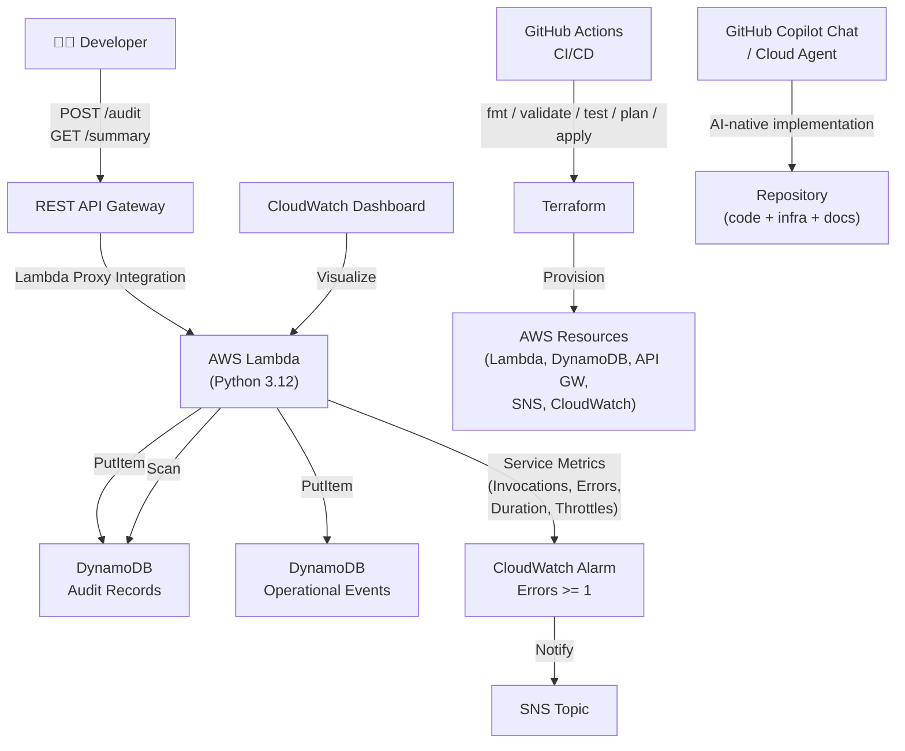

# Platform Ops Auditor

> A minimal, clean, demoable **internal developer platform automation service** built for a Senior Platform Engineer coding challenge.

[](https://github.com/lumen-maximus/ngx-interview/actions/workflows/terraform.yml)

---

## Project Summary

**Platform Ops Auditor** lets developers submit service audit metadata through a REST API. The service validates input, calculates a lightweight operational health score, stores audit records in DynamoDB, and exposes a summary endpoint that aggregates platform operational intelligence.

This project is:
- **Packaged for AWS Lambda** (Python 3.12, handler.handler)
- **Exposed through REST API Gateway** (Lambda proxy integration)
- **Storing critical data in DynamoDB** (audit records + structured operational events)
- **Observable through CloudWatch** metrics, alarm, SNS notification, and dashboard
- **Deployed and managed by Terraform** with a GitHub Actions CI/CD pipeline
- **Built with strict no-wildcard IAM** — no `Action: *`, no `Resource: *`, no ARN wildcards

No application secrets are required for this MVP. AWS credentials are referenced only through GitHub Actions secrets (`AWS_ACCESS_KEY_ID`, `AWS_SECRET_ACCESS_KEY`). The Lambda function itself requires no secrets — it uses its IAM role to access DynamoDB.

---

## Why This Is an Internal Developer Platform Automation Service

Internal developer platforms (IDPs) give platform teams visibility into the services that run on their platform. Platform Ops Auditor solves a real IDP problem: **how do you collect and aggregate service health metadata from many teams?**

Teams `POST` audit records for their services. The platform team queries `GET /summary` to see overall platform health, environment breakdown, and status distribution — all from a single lightweight API backed by serverless infrastructure.

---

## Challenge Coverage

### Core Challenge Checklist

- [x] **AI-native development workflow** — GitHub Copilot Chat / Copilot cloud agent used throughout; documented below
- [x] **Terraform and CI/CD** — Full Terraform configuration with GitHub Actions pipeline (fmt, validate, test, plan, apply)
- [x] **Automation service** — REST API with POST /audit and GET /summary backed by Lambda + DynamoDB
- [x] **Documentation** — README.md, DECISIONS.md, copilot-instructions.md, architecture diagram

### Additional Challenge: Option 4 — Operational Intelligence

- [x] `GET /summary` aggregates all audit records and returns:
  - `total_services_audited`
  - `average_score`
  - `by_environment` breakdown
  - `by_status` breakdown
  - `generated_at` timestamp
- [x] Structured operational events stored in DynamoDB for every key action
- [x] CloudWatch dashboard visualizing Lambda Invocations, Errors, Duration, Throttles
- [x] CloudWatch alarm on Lambda Errors >= 1 with SNS notification

---

## Architecture



---

## API Contract

### POST /audit

**Purpose:** Create a service audit record.

**Request body:**
```json
{
  "service_name": "payments-api",
  "environment": "dev",
  "status": "healthy",
  "repository": "org/payments-api",
  "owner": "platform-team"
}
```

**Validation:**
- `service_name` — required, string, 3–100 characters
- `environment` — required, one of `dev`, `staging`, `prod`
- `status` — required, one of `healthy`, `degraded`, `unhealthy`
- `repository` — optional, string if provided
- `owner` — optional, string if provided

**Successful response (HTTP 201):**
```json
{
  "audit_id": "uuid",
  "service_name": "payments-api",
  "environment": "dev",
  "status": "healthy",
  "score": 95,
  "findings": [
    "service name validated",
    "environment classified",
    "status captured",
    "repository ownership captured",
    "service owner captured",
    "service metadata captured"
  ]
}
```

**Scoring:**
| Condition | Points |
|---|---|
| Base score | 70 |
| valid `service_name` | +5 |
| valid `environment` | +5 |
| valid `status` | +5 |
| `repository` provided | +5 |
| `owner` provided | +5 |
| **Maximum** | **95** |

---

### GET /summary

**Purpose:** Aggregate and present operational intelligence from all audit records.

**Successful response (HTTP 200):**
```json
{
  "total_services_audited": 12,
  "average_score": 84,
  "by_environment": {
    "dev": 5,
    "staging": 3,
    "prod": 4
  },
  "by_status": {
    "healthy": 8,
    "degraded": 3,
    "unhealthy": 1
  },
  "generated_at": 1714495680
}
```

---

## Demo Commands

### Submit a healthy audit record
```bash
BASE_URL=$(terraform -chdir=terraform output -raw api_base_url)

curl -s -X POST "${BASE_URL}/audit" \
  -H "Content-Type: application/json" \
  -d '{
    "service_name": "payments-api",
    "environment": "prod",
    "status": "healthy",
    "repository": "org/payments-api",
    "owner": "platform-team"
  }' | jq .
```

### Get platform operational summary
```bash
curl -s "${BASE_URL}/summary" | jq .
```

### Trigger a validation failure (HTTP 400)
```bash
curl -s -X POST "${BASE_URL}/audit" \
  -H "Content-Type: application/json" \
  -d '{"service_name": "x", "environment": "unknown", "status": "ok"}' | jq .
```

---

## Deployment Steps

### Prerequisites
- Terraform >= 1.6
- AWS CLI configured or GitHub secrets set
- AWS account with permissions to create Lambda, DynamoDB, API Gateway, CloudWatch, SNS, IAM

### Local deployment
```bash
cd terraform
terraform init
terraform validate
terraform test
terraform plan
terraform apply
```

### Via GitHub Actions
1. Set `AWS_ACCESS_KEY_ID` and `AWS_SECRET_ACCESS_KEY` as repository secrets
2. Optionally set `AWS_REGION` as a repository variable (default: `us-east-1`)
3. Trigger `workflow_dispatch` with `apply: true` to deploy
4. Pull requests automatically run `fmt`, `init`, `validate`, `test`, `plan`

### Post-deployment
```bash
terraform output api_base_url     # base URL for API calls
terraform output audit_endpoint   # POST /audit URL
terraform output summary_endpoint # GET /summary URL
terraform output dashboard_name   # CloudWatch dashboard name
```

---

## GitHub Actions CI/CD

The workflow (`.github/workflows/terraform.yml`) runs on:
- **Pull requests** when `terraform/`, `app/`, or the workflow file changes
- **Manual dispatch** with optional `apply: true` to deploy

Pipeline steps:
1. `terraform fmt -check -recursive` — enforces formatting
2. `terraform init`
3. `terraform validate` — checks HCL syntax and provider schema
4. `terraform test` — runs `terraform/tests/platform_ops_auditor.tftest.hcl`
5. `terraform plan -out=tfplan` — generates plan
6. `terraform apply` — only when `apply: true` is passed to `workflow_dispatch`

---

## Observability

| Signal | Implementation |
|---|---|
| Lambda Invocations | CloudWatch metric (AWS/Lambda namespace) |
| Lambda Errors | CloudWatch metric + alarm at >= 1 |
| Lambda Duration | CloudWatch metric on dashboard |
| Lambda Throttles | CloudWatch metric on dashboard |
| Alarm notification | SNS topic |
| Dashboard | CloudWatch dashboard: Invocations, Errors, Duration, Throttles |
| Operational events | DynamoDB (audit_created, validation_failure, summary_generated, unsupported_route, unexpected_error) |

### Why operational events are stored in DynamoDB

Strict no-wildcard IAM means Lambda cannot be granted `logs:CreateLogStream` on `arn:aws:logs:*:*:log-group:/aws/lambda/*:*` (wildcard stream ARN). Rather than grant this permission, structured operational events are written to a dedicated DynamoDB table with exact-ARN `dynamodb:PutItem`. This preserves full observability without compromising IAM hygiene.

---

## No-Wildcard IAM

Every IAM statement uses exact ARNs:

```hcl
# Lambda policy — no wildcards
statement {
  actions   = ["dynamodb:PutItem"]
  resources = [aws_dynamodb_table.audit.arn, aws_dynamodb_table.events.arn]
}

statement {
  actions   = ["dynamodb:Scan"]
  resources = [aws_dynamodb_table.audit.arn]
}
```

API Gateway Lambda permissions use the exact stage/method/path ARN:
```
arn:aws:execute-api:{region}:{account}:{api-id}/{stage}/POST/audit
arn:aws:execute-api:{region}:{account}:{api-id}/{stage}/GET/summary
```

Terraform tests validate that the rendered IAM policy JSON contains no `Action: *`, no `Resource: *`, and no ARN wildcards.

---

## AI-Native Workflow — GitHub Copilot

### How Copilot helped

- **Scaffolded the Lambda handler** (`app/handler.py`) — routing, validation, scoring, DynamoDB writes, and operational event storage from the spec
- **Generated Terraform HCL** for DynamoDB tables, Lambda, API Gateway, IAM, CloudWatch, and SNS
- **Wrote the unit test suite** (`app/test_handler.py`) with mock patching for DynamoDB
- **Drafted the Terraform test file** (`terraform/tests/platform_ops_auditor.tftest.hcl`)
- **Composed README.md and DECISIONS.md** from the architecture decisions
- **Set up `.github/copilot-instructions.md`** as the agent configuration file

### Where Copilot needed course correction

- **IAM wildcards** — Copilot's default Lambda role suggestions used `AWSLambdaBasicExecutionRole` (which grants `logs:*` on `*`). This was replaced with a hand-crafted `aws_iam_policy_document` using exact table ARNs.
- **Log-stream permissions** — Initial suggestions included `logs:CreateLogStream` on wildcard ARNs. These were replaced with the DynamoDB operational events pattern.
- **API Gateway Lambda permissions** — Copilot defaulted to `arn:aws:execute-api:*:*:*` as the `source_arn`. This was corrected to exact stage/method/path ARNs.
- **Archive source directory** — Copilot used `source_file` pointing to `handler.py` only; corrected to `source_dir` pointing to `../app` so all Python files are included.

### How the workflow could be improved

- Add a Copilot-aware linting step (e.g., `checkov` or `tflint`) to automatically flag IAM wildcards before code review
- Use a `.github/copilot-instructions.md` with stricter IAM validation prompts to catch wildcards in the first generation
- Pair Copilot generation with a `terraform test` auto-run so violations are caught immediately in the PR pipeline

---

## Future Improvements

- GSI on `environment` and `status` for efficient filtered queries (instead of table scan)
- Pagination support on `GET /summary` for large datasets
- SNS email subscription setup in Terraform
- CloudWatch log group with exact-ARN permissions for structured JSON logging
- Service-level trend analysis (score over time)
- API key or request signing for write endpoints

---

## Interview Demo Path

1. `terraform init && terraform validate && terraform test` — show CI passes locally
2. `terraform apply` — deploy to AWS
3. `curl POST /audit` — create a healthy audit record (score 95)
4. `curl POST /audit` (validation failure) — show 400 + stored operational event
5. `curl GET /summary` — show aggregated intelligence
6. Open CloudWatch dashboard — show Lambda metrics
7. Show DynamoDB tables — audit records + operational events
8. Show CloudWatch alarm — wired to SNS
9. `terraform output` — show all outputs
10. Walk through `terraform/tests/platform_ops_auditor.tftest.hcl` — explain the no-wildcard IAM assertions

